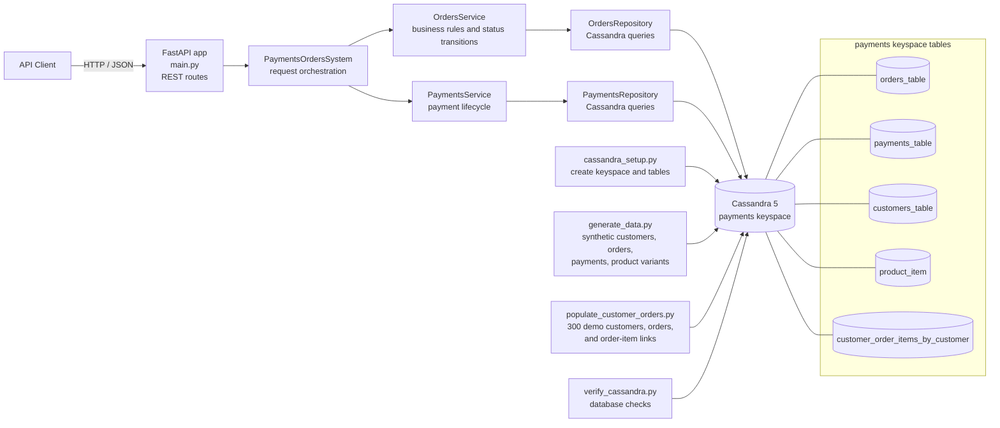

# Payments Orders System - Backend

## Overview

This directory contains the Payments Orders System backend. Orders and payments are separated into logical service modules but currently run together in one FastAPI process. Cassandra is the persistence layer. The architecture below reflects the current implementation; RabbitMQ, Redis, and Prometheus/Grafana are not currently connected to the runtime.

## Architecture



### Request and data paths

1. API clients call the FastAPI routes in `main.py` (orders, payments, root, and statistics).
2. `PaymentsOrdersSystem` delegates order and payment operations to the corresponding service module.
3. Services apply lifecycle/business rules and use their repositories to read/write Cassandra.
4. Setup, generation, and verification scripts connect to Cassandra directly; they do not pass through the HTTP API.

### Cassandra tables

- `orders_table`: order records, partitioned by `order_id`.
- `payments_table`: payment records, partitioned by `payment_id`.
- `customers_table`: synthetic customer profile and location fields, keyed by `customer_id`.
- `product_item`: catalog variants, partitioned by category with brand/product/variant clustering.
- `customer_order_items_by_customer`: denormalized customer-to-order-to-product/variant lines, partitioned by `customer_id` for customer order-history queries.

The service folders are logical modules, not separately deployed microservices yet. There is no event broker or synchronous service-to-service HTTP call in the current request path.

## Project Structure

```
backend_system/
├── __init__.py                    # Package initialization
├── main.py                        # FastAPI app and request orchestration
├── cassandra_setup.py             # Keyspace and table initialization
├── generate_data.py               # Synthetic orders/payments/catalog seed
├── populate_customer_orders.py    # Demo customer/order/product links
├── verify_cassandra.py            # Cassandra verification utility
├── docker-compose.yml             # Local Cassandra container
├── pyproject.toml                 # uv project and dependencies
├── orders_service/                # Orders logical service module
│   ├── __init__.py
│   ├── models.py                  # Order data models
│   ├── repository.py              # Cassandra database operations
│   └── service.py                 # Business logic and orchestration
├── payments_service/              # Payments logical service module
│   ├── __init__.py
│   ├── models.py                  # Payment data models
│   ├── repository.py              # Cassandra database operations
│   └── service.py                 # Business logic and orchestration
```

## Services Overview

### Orders Service
- **Purpose**: Order lifecycle management (create, update, status tracking)
- **Key Features**:
  - Order creation with validation
  - Status management with transition validation
  - Customer order history retrieval
  - Order cancellation and refund processing
  - Integration with Payments Service

### Payments Service
- **Purpose**: Payment processing and validation
- **Key Features**:
  - Payment creation with multiple payment methods
  - Payment processing workflow (pending → processing → completed/failed)
  - Payment retry, refund, and cancellation
  - Gateway integration support
  - Customer payment history retrieval

## Technology Stack

### Core Framework
- **FastAPI**: Async API framework with automatic documentation
- **Pydantic**: Data validation and serialization
- **SQLAlchemy**: Database ORM (for future relational database support)

### Database
- **Cassandra**: Primary database for orders and payments tables
- **Async Driver**: Non-blocking Cassandra operations

### Infrastructure
- **Docker Compose**: Service orchestration (to be implemented)
- **RabbitMQ/Redis Streams**: Event streaming (to be implemented)
- **Prometheus + Grafana**: Monitoring (to be implemented)

## Key Components

### Models
- **Order**: Order data structure with status validation
- **Payment**: Payment data structure with workflow management
- Both models include comprehensive validation, business logic, and serialization

### Repositories
- **OrdersRepository**: Cassandra operations for orders
- **PaymentsRepository**: Cassandra operations for payments
- Both provide CRUD operations with proper error handling

### Services
- **OrdersService**: Business logic for order management
- **PaymentsService**: Business logic for payment processing
- Both orchestrate repository operations with validation

### Main Application
- **PaymentsOrdersSystem**: Main orchestrator class
- **FastAPI Application**: REST API endpoints
- **System Integration**: Database connections and service coordination

## Installation

### Prerequisites
- Python 3.8+
- pip

### Install Dependencies
```bash
cd backend_system
pip install -r requirements.txt
```

## Running the Application

### Development Mode
```bash
cd backend_system
python main.py
```

### Using Uvicorn (Recommended)
```bash
cd backend_system
uvicorn main:app --host 0.0.0.0 --port 8000 --reload
```

## API Endpoints

### Orders API
- `POST /orders` - Create a new order
- `GET /orders/{order_id}` - Get order by ID
- `PUT /orders/{order_id}/status` - Update order status
- `POST /orders/{order_id}/cancel` - Cancel an order

### Payments API
- `POST /payments` - Create a new payment
- `GET /payments/{payment_id}` - Get payment by ID
- `POST /payments/{payment_id}/process` - Process a payment
- `POST /payments/{payment_id}/complete` - Complete a payment
- `POST /payments/{payment_id}/fail` - Fail a payment
- `POST /payments/{payment_id}/refund` - Refund a payment

### System API
- `GET /system/stats` - Get system statistics
- `GET /` - Root endpoint

## Database Schema

### Orders Table
- **Partition Key**: `order_id`
- **Clustering Key**: `created_at`
- **Columns**: `customer_id`, `amount`, `currency`, `status`, `created_at`, `updated_at`, `payment_method`, `payment_id`, `metadata`

### Payments Table
- **Partition Key**: `payment_id`
- **Clustering Key**: `created_at`
- **Columns**: `order_id`, `customer_id`, `amount`, `currency`, `payment_method`, `status`, `created_at`, `processed_at`, `completed_at`, `failed_at`, `refunded_at`, `gateway_response`, `gateway_fee`, `transaction_reference`, `metadata`

## Error Handling

The system implements comprehensive error handling:

1. **Validation Errors**: Input validation using Pydantic
2. **Business Logic Errors**: Status transition validation
3. **System Errors**: Database connection failures
4. **External Service Errors**: Payment gateway failures

All errors are returned with appropriate HTTP status codes and structured error messages.

## Testing

### Unit Tests
```bash
pytest
```

### Integration Tests
```bash
pytest tests/
```

## Configuration

Configuration is managed through environment variables and configuration files:

- Database connection settings
- API server configuration
- Payment gateway credentials
- Logging levels

## Future Enhancements

1. **Docker Support**: Docker Compose for local development
2. **Event Streaming**: RabbitMQ/Redis Streams for real-time updates
3. **Monitoring**: Prometheus metrics and Grafana dashboards
4. **Security**: JWT authentication and role-based access control
5. **Caching**: Redis for performance optimization
6. **Load Testing**: Data generation scripts for testing
7. **CI/CD**: Automated testing and deployment pipelines

## License

This project is part of the Payments Orders System implementation.

## Contact

For questions or support, refer to the main project documentation in the parent directory.